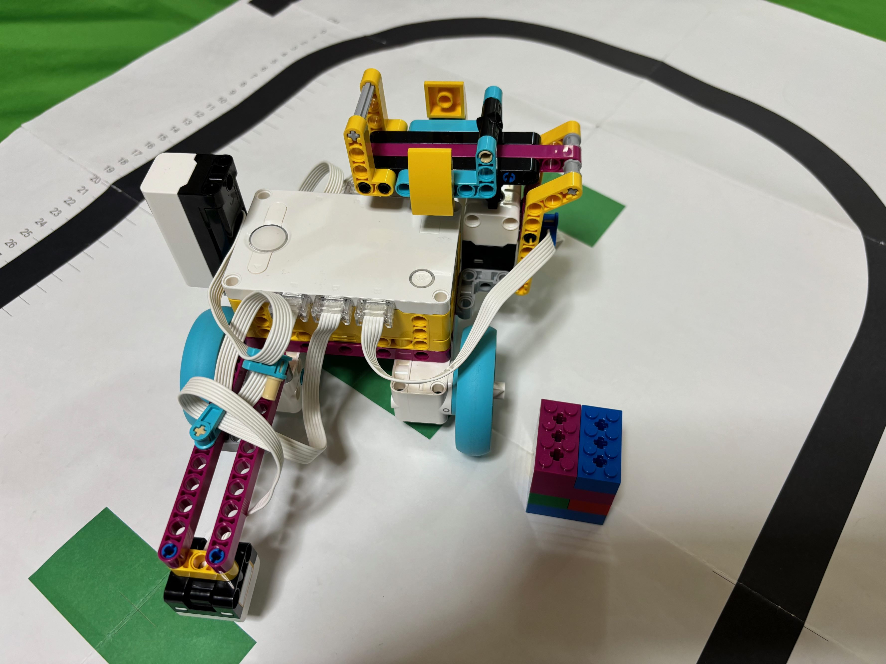
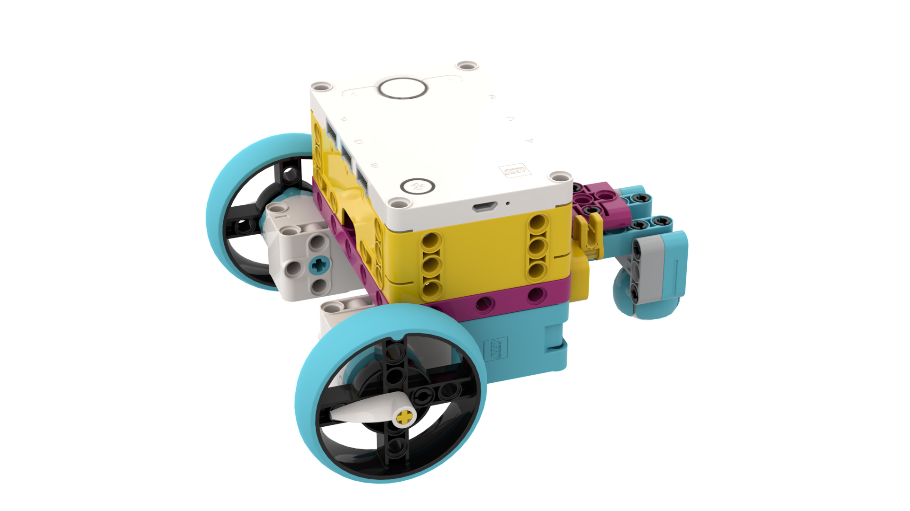
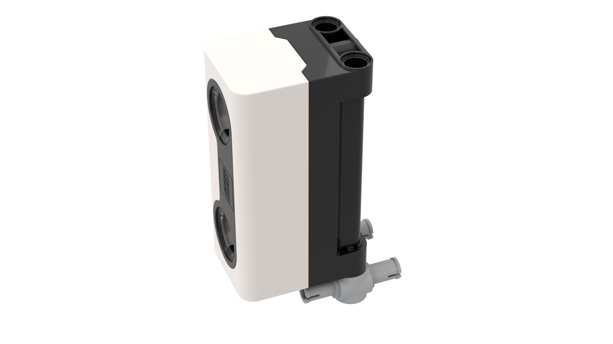
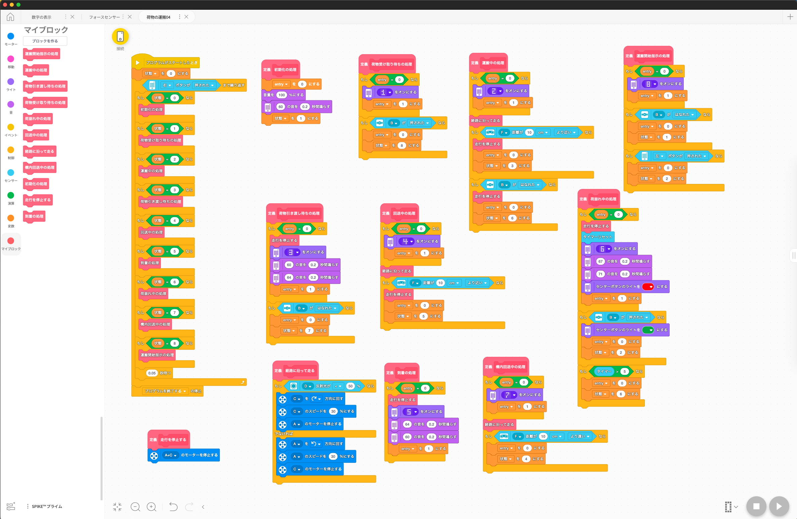

[English](link:README.adoc[]) | [日本語](link:README_ja.adoc[])

= SPIKE Transporter

[.lead]
"Spike Transporter" is the auto transportation vehicle using LEGO SPIKE PRIME <<spike>>  kit.
The vehicle receives the cargo (container), transports it to the delivery destination, and then moves to the garage.
When the cargo is dropped duaring transporting, the vehicle stops temporarily, and once the cargo is loaded, it resumes transport.

[NOTE]
****
Check out my gallery on Bricklink <<bricklink_my_page>> for similar information.

* https://www.bricklink.com/v3/studio/design.page?idModel=541490[my gallery on Bricklink, window=_blank]
****

.Transporter using LEGO SPIKE PRIME kit

== Motivation

I used the LEGO Mindstorms EV3 <<ev3>> kit to build an auto transporter and use it in lectures and training.
However, EV3 will be discontinued in 2021 and will be difficult to obtain in the future.
Therefore, I decided to create a similar transporter "Spike Transporter" using the LEGO SPIKE PRIME kit, which is the successor product.

== Structure of spike transporter

This vehicle consists of several units.

=== Base unit

The base unit is a drive unit that runs on two main wheels and a rear ball.

This unit is used a SPIKE's large hub and two medium motors.

.Base unit

=== Line monitor

The line monitor unit is watcher the transportation route(black line) for the transporter running.

This unit is used a SPIKE's color sensor.

.Line monitor
image::images/spike_transporter_linemon.png[width="60%"]

=== Wall Detector

The wall detector unit recognizes side walls of delivery destinations and garages.

This unit is used a SPIKE's ultrasonic sensor.

.Wall detecotor

=== Carrier and Container

 loading platform is a place where cargo (containers) are placed. We are monitoring the presence of luggage.

The carrier unit is used  SPIKE's force sensor (like a touch sensor).

[cols="1,1",frame=none,grid=none]
|===
a|.Carrier
image::images/spike_transporter_carrier.png[width="120%"]
a|.Container
image::images/spike_transporter_container.png[width="80%"]
|===

== Building instruction

Building instruction were created using "Bricklink Studio".

* Link:images/spike_transporter_instructions.pdf[Building instruction（PDF）]

.sample pages of the building instruction
image::images/build_instruction_sample_page.png[width="80%"]

== Development environment and Program

Here is the software development environment and sample program for Spike Transporter.
It also shows how the sample program works.

=== Development environment

We used the LEGO Education SPIKE application <<spike_app>> to develop the program.

NOTE: Of course, other programming languages ​​may be used as long as they can be used with SPIKE's large hub.

However, unlike Scratch, there are blocks that operate SPIKE's hub, obtain values ​​from sensors, and move motors.

=== Sample Program

The sample program is as follows.

.Sample program(click to open in new window)
[link=images/spike_transporter_program01.png,window=_blank]

NOTE: Please let us know if there is a way to share the program itself instead of this image.

=== How the sample program works

An auto transporter is a robot vehicle that receives a cargo(container) and transports it along the route to the delivery destination.
It works as follows:

.sample program operations
. Start the program.. Then waiting for laoding container on carrier.
. When you load your cargo(container) and press the left button, the vehicle run with following the line.
. If a cargo falls during transport, the vehicle will stop and wait for the cargo to load again.(warning sounds a warning tone every 5 seconds)
. When the vehicle detects the side wall, the vehicle will stop.
. Once the container is unloaded, the vehicle run with following the line again.
. When the vehicle detects the side wall again, the vehicle will stop.

A state machine diagram (a type of state transition diagram) looks like this:

.Statemacine dialog of sample program(sorry, descriptions are only in japanese)
image::images/spike_transporter_statemachine.png[width=80%]

=== Demo video

The first part shows normal transporting the cargo, and the next shows operation when the cargo falls.

.Demo video(sorry, subtitles are only in japanese)
video::nSAXWkLJDxE[youtube,width=640,height=480]

== Contents structure

[source,console]
----
spike_transporter
├── images: LEGO Studio data, images, build instruction.
└── movies_photos: movies and photos.
----

[bibliography]
== References and links

- [[[spike]]] LEGO SPIKE PRIME
** https://education.lego.com/en-us/products/lego-education-spike-prime-set/45678/
** https://education.lego.com/ja-jp/products/-spike-/45678/
- [[[bricklink_my_page]]] Spike Transporter on "My Gallery" at BrickLink
** https://www.bricklink.com/v3/studio/design.page?idModel=541490
- [[[ev3]]] Lego Mindstorms EV3
** https://ja.wikipedia.org/wiki/Lego_Mindstorms_EV3
- [[[spike_app]]] LEGO Education SPIKE App
** https://education.lego.com/ja-jp/downloads/spike-app/software/
