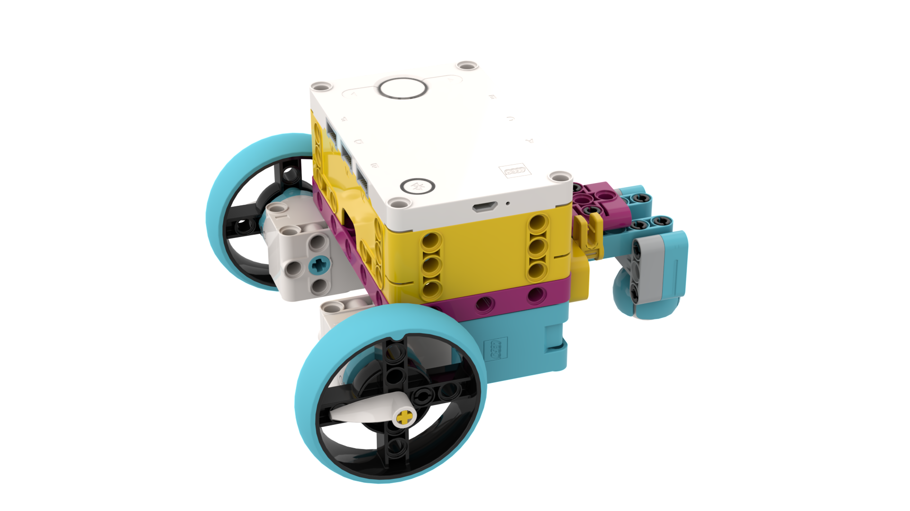
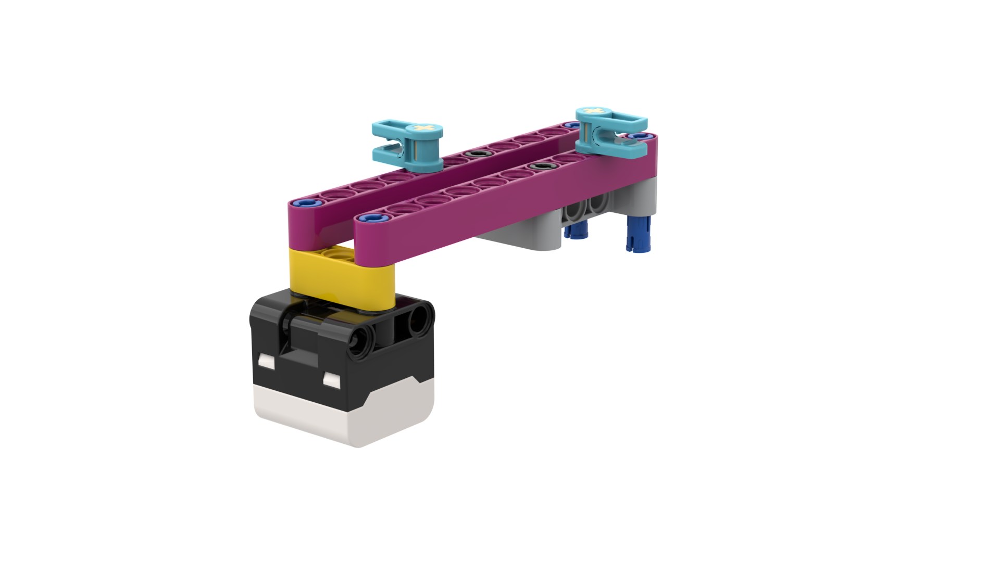
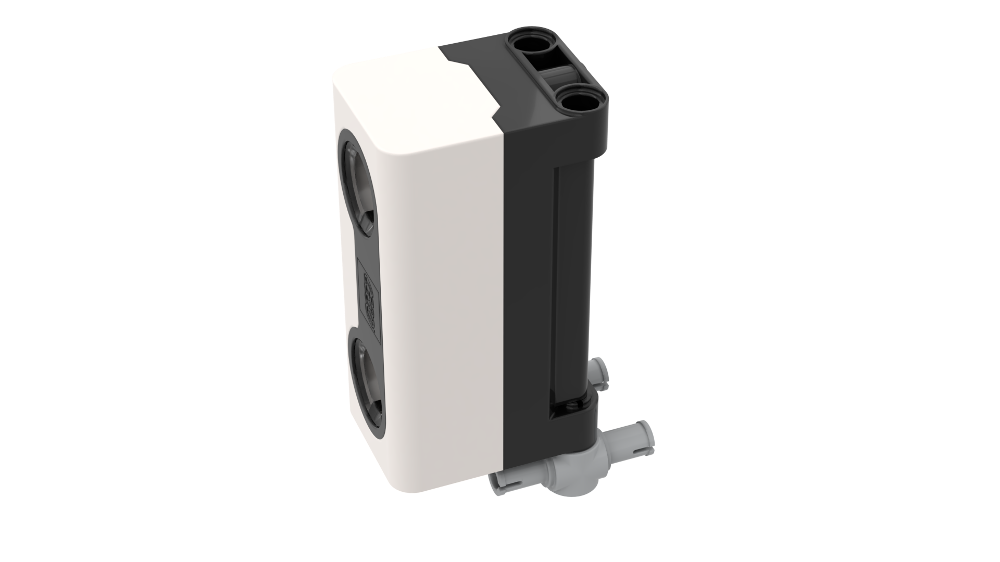
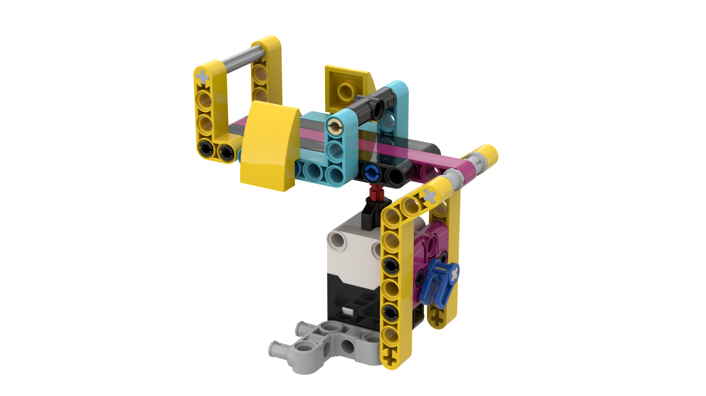
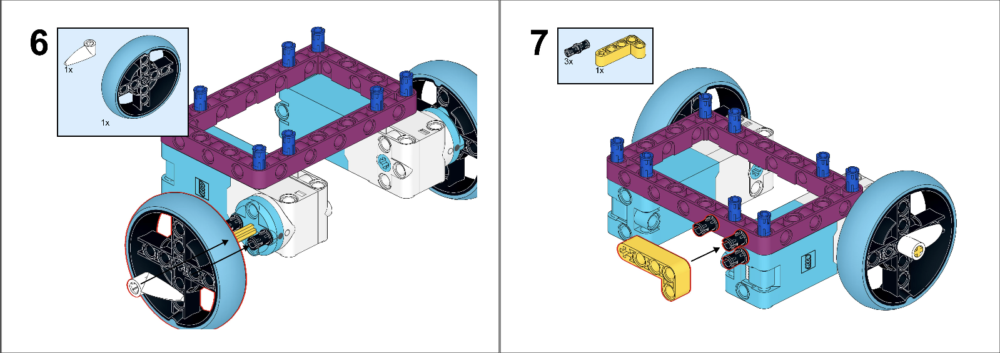
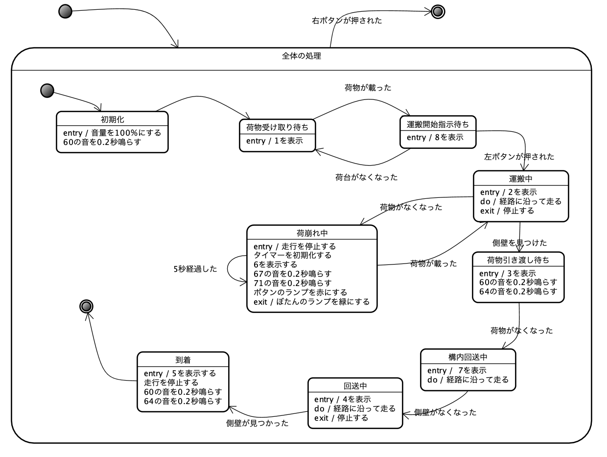

[English](link:README.adoc[]) | [日本語](link:README_ja.adoc[])

= SPIKE Transporter

[.lead]
「Spike Transporter」は、LEGO SPIKE PRIME <<spike>>  のキットを使って製作した自動荷物運搬車です。
荷物（コンテナ）を受け取り、配達先へ届け、その後車庫まで移動します。
荷物が落下したら一時停止し、荷物が載せられると、運搬を再開します。

[NOTE]
****
Bricklinkの私のギャラリー <<bricklink_my_page>> にも類似の情報をアップしてあリますので、訪ねてみてください。

* https://www.bricklink.com/v3/studio/design.page?idModel=541490[Bricklinkのギャラリーページ, window=_blank]
****

.LEGO SPIKE PRIMEのキットで製作した自動搬送車
image::movies_photos/spike_transporter_front.jpeg[width="60%"]

== 製作の動機

私は、 LEGO Mindstorms EV3 <<ev3>> のキットを使って自動荷物運搬車を製作し、講義や研修で利用していました。
しかし、EV3は2021年に販売終了となり、今後は入手しにくくなりました。
そこで、後継の製品となるLEGO SPIKE PRIMEのキットを使って、類似の自動荷物運搬車を製作しようと考えました。

== 自動荷物搬送車の構成

自動搬送車はいくつかのユニットで構成されています。

=== ベースユニット

ベースユニットは、2つの車輪と後部のボールで地面を走行するユニットです。
SPIKEのラージハブと2つのミディアム・モーターを使っています。

.ベースユニット

=== 経路監視ユニット

経路監視ユニットは、自動荷物搬送車が走行する経路（黒いライン）を監視します。
SPIKEのカラーセンサーを使っています。

.経路監視ユニット

=== 側壁監視ユニット

側壁監視ユニットは、荷物（コンテナ）の配達先の壁や回送先の車庫の壁を認識します。
SPIKEの超音波センサーを使っています。

.側壁監視ユニット

=== 荷台とコンテナ

荷台は、荷物（コンテナ）を載せる場所です。荷物の有無を監視しています。
SPIKEのフォースセンサー（タッチセンサーの仲間）を使っています。

[cols="1,1",frame=none,grid=none]
|===
a|.荷台

a|.コンテナ

|===

== 組立図

組立図は、Bricklink Studio で作成しました。

* Link:images/spike_transporter_instructions.pdf[自動荷物運搬車の組立図（PDF）]

.組立図のページの例

== 開発環境とプログラム

自動荷物運搬車のソフトウェアの開発環境、サンプルプログラム、サンプルプログラムの動作の様子です。

=== 開発環境

プログラムの開発には、LEGO Education SPIKEアプリケーション <<spike_app>> を使いました。

NOTE: もちろん、SPIKEのラージハブで利用できるのでしたら、他のプログラミング言語でもかまわないでしょう。

プログラミング方法は、Scratchと同じようなものです。
ただし、Scratchとは異なり、SPIKEのハブを操作する、センサーからや値を取得する、モーターを動かすといったブロックが用意されています。

=== サンプルプログラム

サンプルプログラムは、次の通りです。

.サンプルプログラム（クリックすると別ウィンドウで開きます）
[link=images/spike_transporter_program01.png,window=_blank]
image::images/spike_transporter_program01.png[width="60%"]

NOTE: この画像ではなく、プログラム自体を共有する方法があれば教えてください。

=== サンプルプログラムの動作

荷物を受け取り、経路に沿って配達先まで荷物（コンテナ）を運搬するロボットです。
次のような手順で動作します。

.サンプルプログラムの動作
. プログラムを起動します。
. 荷物を乗せて左ボタンを押すと、経路に沿って走行します。
. 運搬中に荷物が落ちると、停止して、荷物が戻されるのを待ちます。（5秒ごとに警告音を鳴らします）
. 側壁を検知すると、停止します。
. 荷物がおろされると、再び走行します。
. び側壁を検知したら、業務を終了（停止）します。

ステートマシン図（状態遷移図の一種）で表すと、次のようになります。

.サンプルプログラムのステートマシン図

=== 実行時の動画

前半は荷物を運搬する動作、後半は荷物が落ちた場合の動作です。

.実行の様子
video::nSAXWkLJDxE[youtube,width=640,height=480]

== コンテンツの構造

[source,console]
----
spike_transporter
├── images: LEGO Studio data, images, build instruction.
└── movies_photos: movies and photos.
----

[bibliography]
== 文献やリンク

- [[[spike]]] LEGO SPIKE PRIME
** https://education.lego.com/en-us/products/lego-education-spike-prime-set/45678/
** https://education.lego.com/ja-jp/products/-spike-/45678/
- [[[bricklink_my_page]]] Spike Transporter on "My Gallery" at BrickLink
** https://www.bricklink.com/v3/studio/design.page?idModel=541490
- [[[ev3]]] Lego Mindstorms EV3
** https://ja.wikipedia.org/wiki/Lego_Mindstorms_EV3
- [[[spike_app]]] LEGO Education SPIKE App
** https://education.lego.com/ja-jp/downloads/spike-app/software/
